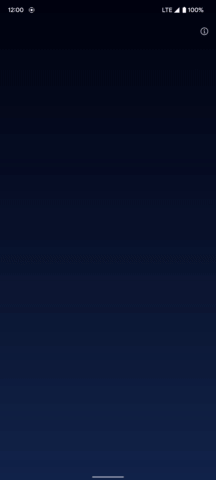
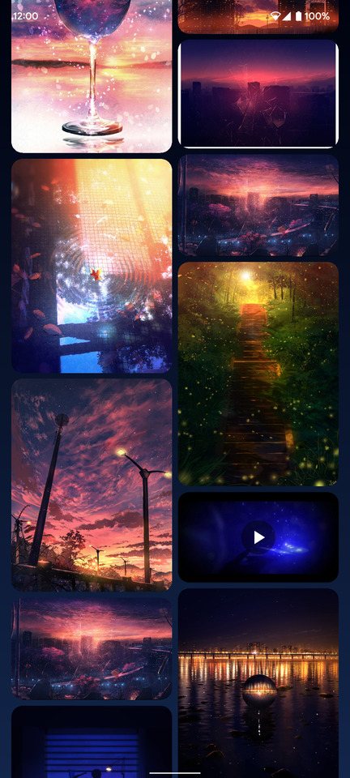
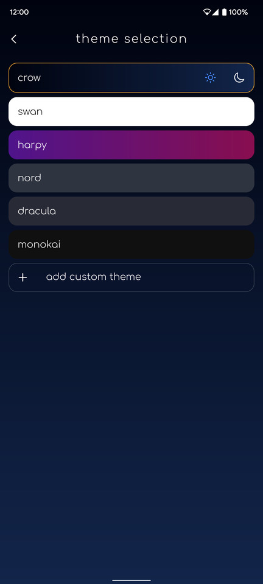
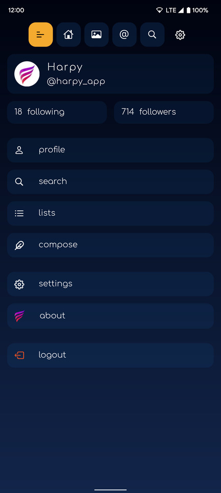
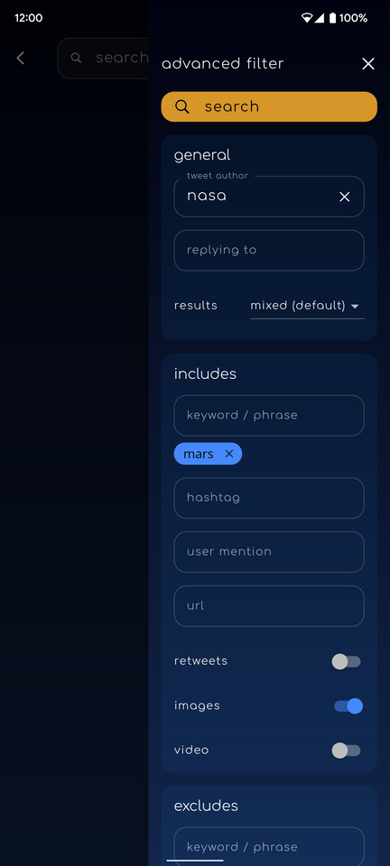

  

  <kbd></kbd>
  <kbd></kbd>

  
More images

  
  | **Media timeline** | **Theme selection** |
  | :---: | :---: |
  | <kbd></kbd> | <kbd></kbd> |
  | **Menu** | **Tweet search filter** |
  | <kbd></kbd> | <kbd></kbd> |

## Developer
>Rwema Bagirishya

## About

harpy is a fully featured Twitter client that focuses on great UI/UX and a clean experience.

This project aims to provide a good example for a medium-big sized Flutter app
in hopes that it will be useful for some.

Some interesting features of the app include:

* [flutter_bloc](https://pub.dev/packages/flutter_bloc) for the main state management, using blocs and cubits.
* [get_it](https://pub.dev/packages/get_it) as a service provider that includes
  the ability to navigate and to show on screen messages from anywhere in the app.
* [sentry](https://pub.dev/packages/sentry) as an online error tracking service to report unhandled exceptions.
* Fully featured theme customization.
* Fully featured video player using the
  [video_player](https://pub.dev/packages/video_player) package.
* A 'pro' and 'free' android
  [product flavor](https://developer.android.com/studio/build/build-variants).

### Building

The app can be built with the "free" or "pro" flavor by running:

* `flutter run --flavor free --dart-define=flavor=free --dart-define=twitter_consumer_key=your_consumer_key --dart-define=twitter_consumer_secret=your_consumer_secret`
* `flutter run --flavor pro --dart-define=flavor=pro --dart-define=twitter_consumer_key=your_consumer_key --dart-define=twitter_consumer_secret=your_consumer_secret`

### Thanks | Murakoze!